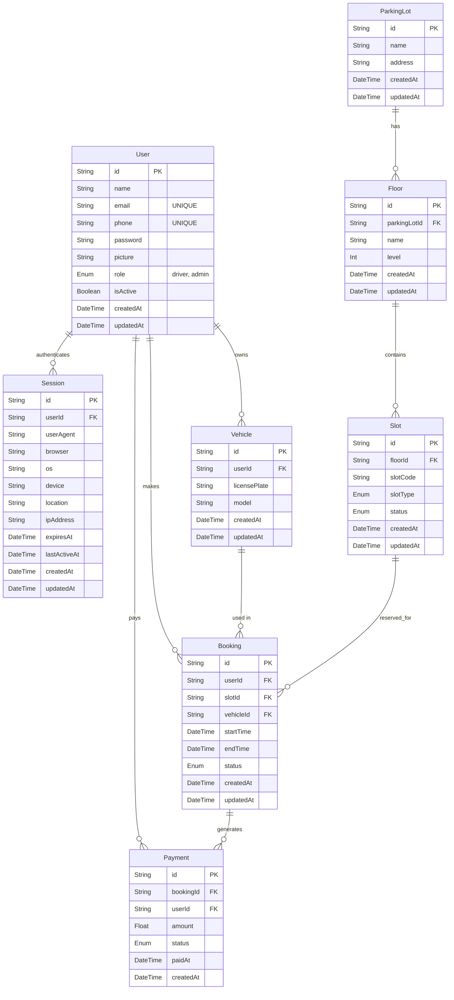

# Entity Relationship Diagram

```mermaid
erDiagram
    User ||--o{ Session : authenticates
    User ||--o{ Booking : makes
    User ||--o{ Vehicle : owns
    User ||--o{ Payment : pays
    Vehicle ||--o{ Booking : "used in"
    ParkingLot ||--o{ Floor : has
    Floor ||--o{ Slot : contains
    Slot ||--o{ Booking : reserved_for
    Booking ||--o{ Payment : generates

    User {
        String id PK
        String name
        String email "UNIQUE"
        String phone "UNIQUE"
        String password
        String picture
        Enum role "driver, admin"
        Boolean isActive
        DateTime createdAt
        DateTime updatedAt
    }

    Session {
        String id PK
        String userId FK
        String userAgent
        String browser
        String os
        String device
        String location
        String ipAddress
        DateTime expiresAt
        DateTime lastActiveAt
        DateTime createdAt
        DateTime updatedAt
    }

    Vehicle {
        String id PK
        String userId FK
        String licensePlate
        String model
        DateTime createdAt
        DateTime updatedAt
    }

    ParkingLot {
        String id PK
        String name
        String address
        DateTime createdAt
        DateTime updatedAt
    }

    Floor {
        String id PK
        String parkingLotId FK
        String name
        Int level
        DateTime createdAt
        DateTime updatedAt
    }

    Slot {
        String id PK
        String floorId FK
        String slotCode
        Enum slotType
        Enum status
        DateTime createdAt
        DateTime updatedAt
    }

    Booking {
        String id PK
        String userId FK
        String slotId FK
        String vehicleId FK
        DateTime startTime
        DateTime endTime
        Enum status
        DateTime createdAt
        DateTime updatedAt
    }

    Payment {
        String id PK
        String bookingId FK
        String userId FK
        Float amount
        Enum status
        DateTime paidAt
        DateTime createdAt
    }
```
