# Sequence Diagram: Booking & Check-in Flow

This sequence diagram illustrates the step-by-step process of the most critical use case: a Driver searching for, booking, paying, and finally checking into a parking slot securely mapped into the PostgreSQL database.

```mermaid
sequenceDiagram
    autonumber

    %% Participants
    actor Driver
    participant Frontend as React Web App
    participant Backend as Express/Node API
    participant DB as PostgreSQL Database
    participant Payment as Payment Gateway
    actor Admin as Admin (On-Site)

    %% Flow 1: Search & Selection
    rect rgb(30, 30, 30)
    note right of Driver: 1. Search & Selection
    Driver->>Frontend: Selects intended parking date/time
    Frontend->>Backend: GET /api/booking/available-slots
    Backend->>DB: Query SLOTS not involved in overlapping BOOKINGS
    DB-->>Backend: Return available slots
    Backend-->>Frontend: JSON List of slots
    Frontend-->>Driver: Displays available slots
    end

    %% Flow 2: Booking Creation
    rect rgb(40, 40, 40)
    note right of Driver: 2. Booking a Slot
    Driver->>Frontend: Clicks "Book" on a specific slot
    Frontend->>Backend: POST /api/booking
    Backend->>DB: Verify slot is STILL available
    DB-->>Backend: Slot is free
    Backend->>DB: Insert new BOOKING (status = "pending")
    Backend-->>Frontend: Return Booking ID
    end

    %% Flow 3: Payment Processing
    rect rgb(30, 30, 30)
    note right of Driver: 3. Payment Processing
    Driver->>Frontend: Enters payment details & Submits
    Frontend->>Payment: Process Transaction

    alt Payment Successful
        Payment-->>Frontend: Success
        Frontend->>Backend: POST /api/payment (Confirm)
        Backend->>DB: Insert new PAYMENT record (Links to User/Booking)
        Backend->>DB: Update BOOKING status to "confirmed"
        Backend-->>Frontend: Success Receipt
        Frontend-->>Driver: Shows Digital Ticket / QR Code
    else Payment Failed
        Payment-->>Frontend: Payment Declined Error
        Frontend->>Backend: PATCH /api/booking/{id}/cancel
        Backend->>DB: Update BOOKING status to "cancelled"
        Frontend-->>Driver: Displays failure message
    end
    end

    %% Flow 4: Arrival & Check-In
    rect rgb(40, 40, 40)
    note right of Driver: 4. Physical Arrival & Check-in
    Driver->>Admin: Reaches gate & presents Digital Ticket
    Admin->>Frontend: Scans ticket / Enters ID
    Frontend->>Backend: GET /api/booking/{id}/verify
    Backend->>DB: Fetch booking by ID
    DB-->>Backend: Booking verified (status="confirmed")
    Backend-->>Frontend: Valid Booking Data

    Admin->>Frontend: Clicks "Check-in Vehicle"
    Frontend->>Backend: PATCH /api/booking/{id}/checkin
    Backend->>DB: Update BOOKING status to "active"
    Backend->>DB: Update SLOT status to "occupied"
    Backend-->>Frontend: Check-in successful
    Admin-->>Driver: Opens gate / Grants access
    end
```

