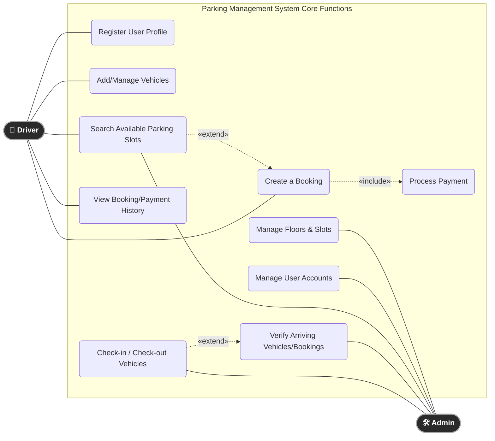

# Use Case Diagram

This diagram maps out the primary actions that each user role (`driver` and `admin`) can perform within the Parking Management System. 

It also includes correct UML `<<include>>` and `<<extend>>` relationships to show dependencies between functions, and standardizes the actor links without directional arrows.

